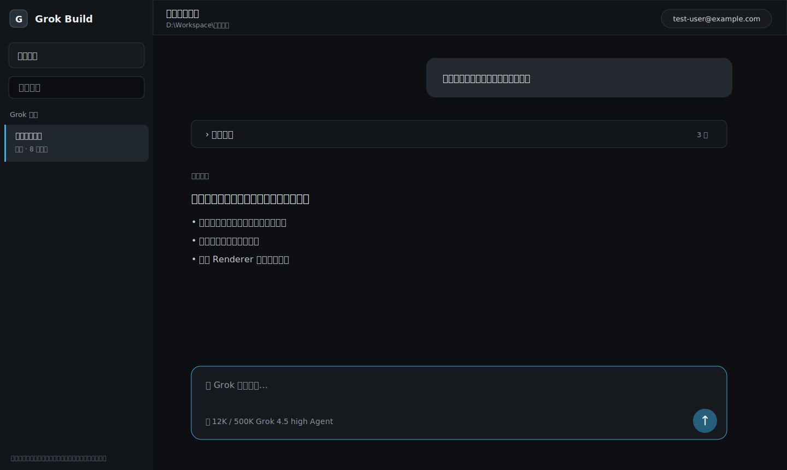

# Grok Build Desktop

> 非官方社区客户端，与 xAI 无隶属关系。Grok、Grok Build 与相关商标归其权利人所有。

Grok Build Desktop 是面向 Windows 中文用户的 Grok Build CLI 图形客户端。应用通过 ACP 连接用户本机安装的 Grok CLI，提供项目会话、流式对话、工具与 Diff、插件中心、额度面板、Codex 项目会话只读镜像，以及实验性的 Windows Computer Use。



## 功能

- OAuth / API Key 配置档与 Windows DPAPI 加密，多账号切换。
- Grok 会话新建、恢复、搜索、置顶、导出与后台通知。
- Codex 风格的回合、多层执行过程折叠、Markdown/GFM、公式、Mermaid、Diff 和媒体。
- 动态模型、推理强度、Agent / Plan / 自动批准模式。
- Grok 插件、Marketplace、Skills、MCP、Hooks 和 Codex 插件兼容扫描。
- 项目范围 Codex 会话只读镜像，并可创建独立 Grok 接力会话。
- OAuth 周/月/按量额度（取决于当前 Grok CLI 与账号接口）。
- Windows Computer Use：精确窗口、可见操作状态、紧急停止和高影响操作确认。
- Codex 风格“+”添加面板：文件、图片、文件夹、工作区文件和已启用插件 Skills；Computer Use 以单次消息能力芯片启用，发送前不提前选择窗口。
- 经典深色、经典浅色、跟随 Windows、自定义纯色和本地背景图片；背景可只作用于对话区或整个应用内容区。
- 首次运行向导、兼容诊断、脱敏支持包和仅提示式应用更新。
- 自定义模型提供商：Chat Completions、Responses、Anthropic Messages、本地服务、模型拉取与连接测试；凭据只引用 Windows 当前用户环境变量。
- 关闭主窗口后仍能触发的 Windows 持久定时任务：一次、每日、每周、固定间隔、运行记录、通知和高影响操作确认。
- 活动回合消息队列与 `Ctrl+Enter` 插话、队列编辑/排序、会话分叉、对话/文件回退、会话归档及统一任务中心（取决于 CLI 能力探测）。

## 系统要求

- Windows 10 22H2 或 Windows 11，x64。
- 简体中文界面；Windows ARM64 模拟、网络盘和 UNC 仅提供诊断提示。
- [Grok Build CLI](https://docs.x.ai/build/overview)（应用不重新分发 CLI）。

## 安装

从[我的仓库 Releases](https://github.com/wangyingxuan383-ai/grok-build-desktop/releases)页面选择：

- `Grok-Build-Desktop-Setup-vX.Y.Z-x64.exe`：当前用户 NSIS 安装版，无需管理员权限。
- `Grok-Build-Desktop-Portable-vX.Y.Z-x64.zip`：解压后直接运行，其中的用户数据仍写入 `%APPDATA%\Grok Build Desktop`。

本项目首批 Release **没有代码签名**。Windows 可能显示 SmartScreen 提示。请从本仓库 Release 下载，并使用同一 Release 中的 `SHA256SUMS.txt` 校验：

```powershell
Get-FileHash .\Grok-Build-Desktop-Setup-v0.5.3-x64.exe -Algorithm SHA256
```

应用不会静默下载或自动执行未签名安装包。

## 安装与登录 Grok CLI

在 PowerShell 中执行 xAI 官方安装命令：

```powershell
irm https://x.ai/cli/install.ps1 | iex
```

首次运行向导会从用户配置、`%USERPROFILE%\.grok\bin\grok.exe` 和 `PATH` 查找 CLI，并提供 OAuth 或 API Key 登录。设置页也可指定自定义路径。

## 从源码构建

需要 Node.js 24 LTS、npm 11+、PowerShell 5.1+ 和 Windows x64。仓库固定依赖版本并提交 `package-lock.json`。

```powershell
git clone https://github.com/wangyingxuan383-ai/grok-build-desktop.git
cd grok-build-desktop
npm ci
npm run verify
npm run package:win
```

一键脚本：

```powershell
.\scripts\bootstrap.ps1
```

默认不会修改贡献者桌面；只有显式传入 `-CreateShortcut` 才创建开发版快捷方式。

本地调试可将 `app.local.example.json` 复制为被 Git 忽略的 `app.local.json`，然后使用 `npm run dev:local`。该文件不得保存 Token、API Key 或账号。

## 代理和数据位置

- 应用设置与加密账号：`%APPDATA%\Grok Build Desktop`
- 自定义背景副本：`%APPDATA%\Grok Build Desktop\themes`（应用只保存自己的副本，不持续依赖原图片）
- Grok CLI、插件与原始会话：`%USERPROFILE%\.grok`
- 持久任务定义与运行记录：`%APPDATA%\Grok Build Desktop\automations`（提示词使用 Windows DPAPI 加密）
- Codex 镜像：只读访问 Codex 本地会话；不会修改原文件。

应用继承 `HTTP_PROXY` / `HTTPS_PROXY`，也可在设置页覆盖。诊断支持包只记录代理“是否配置”，不导出地址或认证。

## 验证

```powershell
npm run verify       # 默认离线：不读取真实 auth.json，不调用模型，不查询额度
npm run verify:live  # 显式真实 CLI / 账号 / 插件 / Computer Use 验收
npm run check:public # 扫描个人路径、邮箱、代理与凭据模式
```

## 常见问题

**为什么没有自动更新？** 公开首版未签名，只检查 GitHub 稳定 Release 并打开下载页，避免静默执行未签名程序。

**卸载会删除对话吗？** NSIS 默认保留 `%APPDATA%`、`%USERPROFILE%\.grok` 和 Grok 会话。若要完全清理，请在确认备份后手动删除。

**Computer Use 能点 UAC 吗？** 不能。UAC、Windows 安全、验证码与安全桌面必须由用户手动完成，之后再让任务继续。

**如何切换浅色或自定义背景？** 打开“功能 → 设置 → 外观与背景”。主题即时生效；背景图片不会进入日志或诊断支持包。

**定时任务在应用关闭后会运行吗？** 会。启用的持久任务由当前用户、最低权限的 Windows Task Scheduler 唤醒无窗口 Worker；Computer Use 任务仍要求桌面已解锁，高影响操作会暂停等待确认。

**自定义提供商的密钥保存在哪里？** 默认保存为 Windows 当前用户环境变量，`config.toml` 只保存变量名。相同 Windows 用户下的其他进程也可能读取用户环境变量。

**支持 macOS / Linux / 英文吗？** v0.5.3 不支持。当前目标是 Windows x64 与简体中文。

## 贡献与安全

请阅读 [CONTRIBUTING.md](CONTRIBUTING.md)、[SECURITY.md](SECURITY.md) 和 [隐私说明](docs/PRIVACY.md)。Bug 报告不得附带真实 Token、完整日志、工作区源码或未脱敏截图。

仓库入口：[我的 GitHub 仓库](https://github.com/wangyingxuan383-ai/grok-build-desktop) · [版本发布](https://github.com/wangyingxuan383-ai/grok-build-desktop/releases) · [问题反馈](https://github.com/wangyingxuan383-ai/grok-build-desktop/issues)

## 许可证

[MIT](LICENSE)。第三方组件见 [THIRD_PARTY_NOTICES.md](THIRD_PARTY_NOTICES.md)，Release 同时提供 CycloneDX SBOM 和许可证报告。
