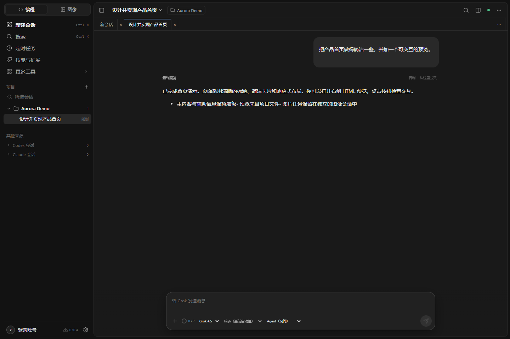
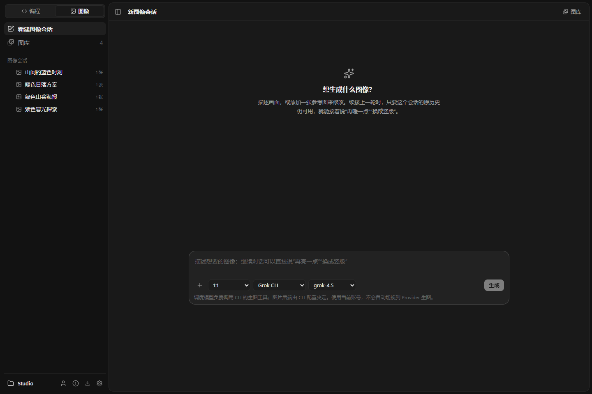
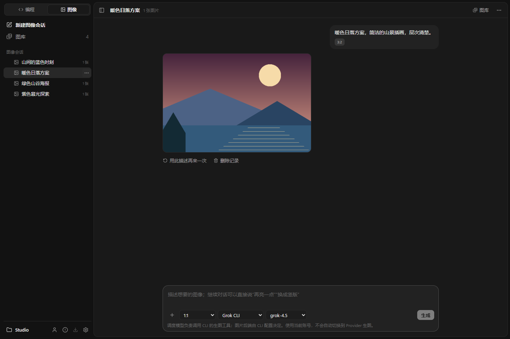
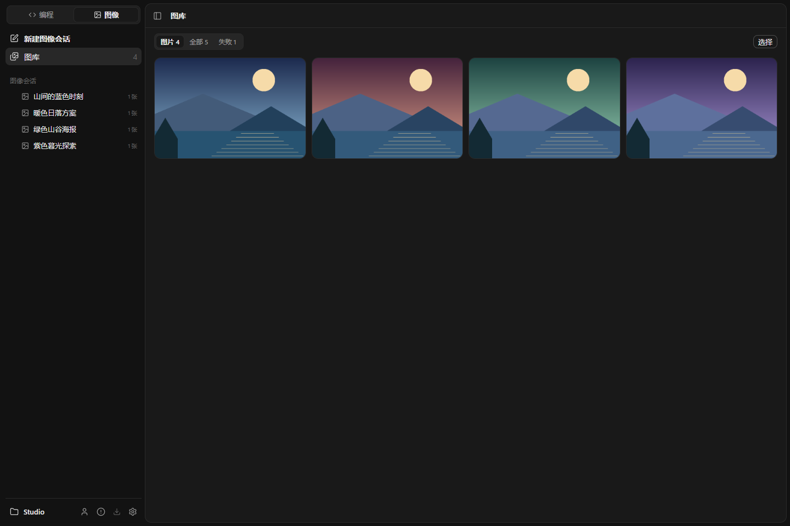
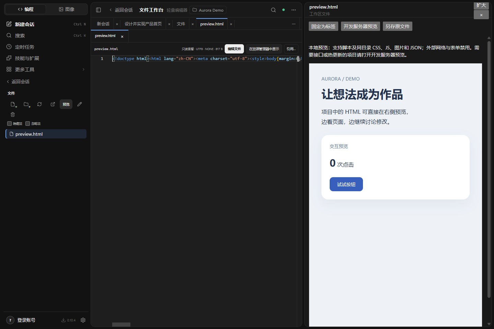
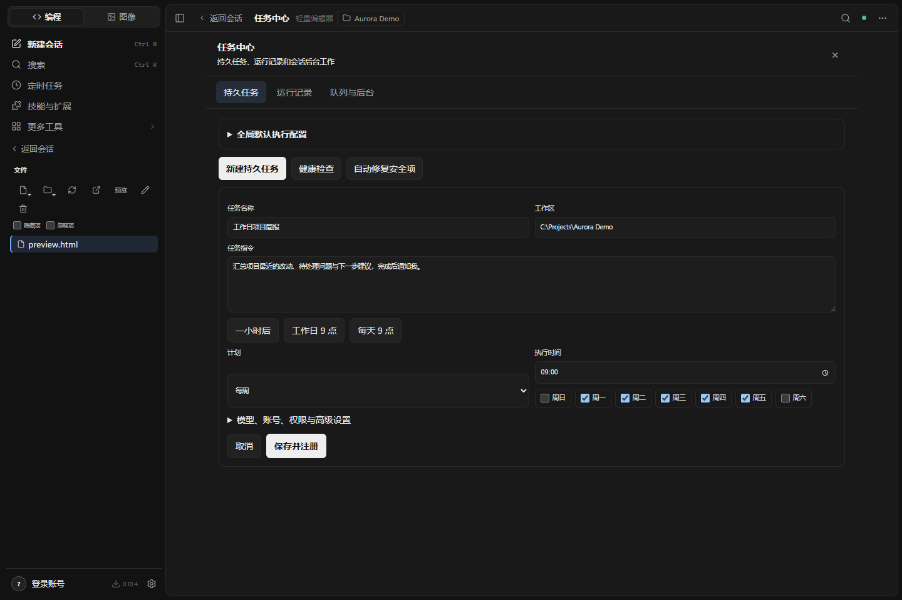

# 界面展示

以下是 0.10.4 界面的实际截图，使用隔离演示项目、合成会话与自行绘制的示例插画。未使用真实账号、私人会话或付费模型调用；图中生成结果不构成模型能力或速度的证明。安装包版本以 [Releases](https://github.com/wangyingxuan383-ai/grok-build-desktop/releases/latest) 为准。

## 编程工作台

项目和会话在左侧，内容标签在中央，消息输入保留模型、模式与上下文入口。

## 图像输入

图像模式使用独立会话和输出目录。无需选择编程项目，可添加参考图并选择本次生成参数。

## 图像会话

请求和作品按生成顺序排列，可以继续描述修改、复用请求或删除记录。

## 图库

默认展示图片；全部和失败筛选仍可打开。单张删除、批量选择与两图比较使用同一作品身份。

## HTML 产物

同目录资源在隔离预览中加载。预览支持脚本，但不向页面开放应用 IPC 或外部网络。

## 定时任务

名称、工作区、任务指令和时间作为主要字段；模型、账号和权限等放在高级设置中。截图仅展示填写状态，没有注册计划任务。

演示在独立配置目录中运行，不读取或修改日常会话。
